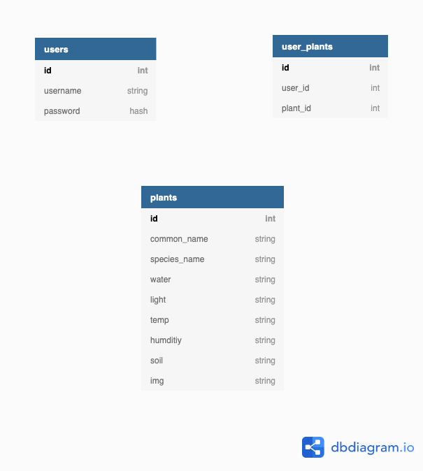

# -----PLANNING PRIORTY ---

## ADD WIREFRAMES HERE

### ADD NOTES - Major Components


#### Major Components

| Route | Component | Notes |
|---|---|---|
| / | App | Root Component |
| / | Header | Shows on all pages |
| /Home | AllWalks |
| /login | Login | NOT Authenticated |
| /register | Register | NOT Authenticated |
| /plants/saved | SavedPlants | Authenticated |
| /plants/:name | IndividualWalk
| /user | User
|---|---|---|


#### Components & Children

App\
\
-- Header\
-- -- Nav\
\
-- Home\
-- -- PlantList\
-- -- -- Plant
\
-- IndividualPlant\
\
-- SavedPlants\
-- -- PlantList\
-- -- -- Plant
\
-- Login\
-- Register\
-- User\

# -----then do: ---

# API

| Method | Path | Description | NOTES |
|---|---|---|---|
| POST | /api/v1/register | adds a user - registering them | Authenticare
| POST | /api/v1/login | logging in a user and getting user info from DB | Authenticare
| GET | /api/v1/plants | let us see all plants on the page
| GET | /api/v1/plant/:name | shows individual plant with all details 
| POST | /api/v1/addplant | add a plant to my profile
| GET | /api/v1/plants/saved | shows the logged in persons plants
| POST | /api/v1/plants/saved/:id | saves a plant to a users saved plants table
| GET | /api/v1/user | Get the user information
|---|---|---|---|

# API Request and response bodies

### /api/v1/plants

##### _Response_

```js 
     plants: [{
    0: {
      id: int,
      common_name: string,
      species_name: string,
      img: url
      },
  }],
```

### /api/v1/plant/:name

##### _Response_

```js
{
      id: int,
      common_name: string,
      species_name: string,
      water: string,
      light: string,
      temp: string,
      humidity: string,
      soil: string,
      img: url
      }
```

### /api/v1/addplant

##### _Request_

```js
{
 user_plants: {
      id: int,
      user_id: int,
      plant_id: int,
      name: string,
      notes: string,
      img: url
  }
}
```

##### _Response_
<!-- TODO: What will the response be? -->

### /api/v1/user

##### _Response_

```js
{
  id
  username
}
```

### /api/v1/plants/saved

##### _Response_

```js
 user_plants: [{ 
    0: {
      id: int,
      user_id: int,
      plant_id: int,
      name: string,
      notes: string,
      img: url
      },
  }]
```

# Global State

The global state object looks a bit like this:


```js

const globalState = {
  search: {
    //search funcitonality for specific plant?
  },
  plants: [{
    0: {
      id: int,
      common_name: string,
      species_name: string,
      water: string,
      light: string,
      temp: string,
      humidity: string,
      soil: string,
      img: url
      },
  }],
  auth: {
    loggedIn: bool,
    user: {
      id: int,
      username: string,
    }
  },
  user_plants: {
      id: int,
      user_id: int,
      plant_id: int,
      name: string,
      notes: string,
      img: url
  }
}
```

# Database Diagram



# Leaf it to me

# Getting Started

* Clone & Make a branch Steps 1 - 4
* Merge your feature Steps 5 - 11

## 1. Clone
```
cd workspace
git clone + https link
cd myRepo
```
## 2. Make a branch using the name of your feature
```
git checkout -b feature/aFeature  
code .  
```
## 3. Instal modules & reset the database
```
npm i
npm run knex migrate:latest
npm run knex seed:run
```
## 4. Commit & Push your branch
```
git status 
git add .  
git commit -m “commit message”  
git push origin myBranch  
```


# MERGE TIME!! Git Protocol in a Team!
* Feature is done, ready to create a pull request to Development?? 

## 5. Commit your branch
```
git add .  
git commit -m “readyToMerge”   
```

## 6. Pull Development into your branch, open VScode & deal with the conflicts there.

```
git pull origin Development
code .
```
## 7. Vscode

* Files marked C = Conflict
* Files marked M = Modified
* <<<<< Head  = This is you! Current changes, you are HEAD
* <<<<<< Incoming change = pulled in from the Development branch

## 8. Any conflicts or changes need to be saved, added, & committed again

```
git add .
git commit -m “mergeTime”
git push origin myBranch
```
## 9. Github - create pull request

* Create pull request from mybranch to Development (on github)
* Tell the git keeper, they will merge the pull request and there should be 0 conflicts as you have already resolved these in your branch.

# Create a new branch with a new name
```
git checkout -b feature/myNextFeature  
code .  
```
## 10. GitKeeper - merge the request

* Merge the pull request on Github only if there are 0 conflicts, then delete the branch.

## 11. Everyone else now needs to pull from Development & update their modules
```
git pull origin Development
npm i
```
* Reset database
```
rm server/db/dev.sqlite3
npm run knex migrate:latest
npm run knex seed:run

```

## Update 

run this in the terminal for auth:

```
 cp .env.example .env
```
once your database has first been populated, you can now use this shortcut
to delete the sql file, run migrations and run seed sequentially
```
npm run db-reset
```
